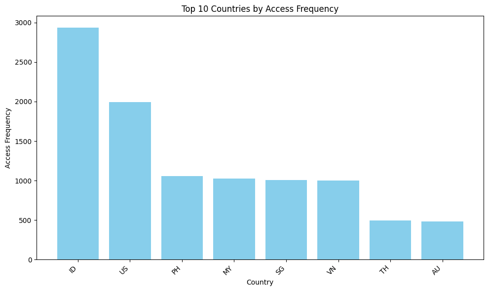

# 📊 Data Analyst Portfolio

Welcome to my Data Analyst Portfolio Repository.  
This repository highlights a selection of analytical projects that demonstrate my ability to work across the entire data lifecycle data collection, cleaning, exploration, visualization, and insight communication to support data-driven decision-making.

---

## 🎯 Objectives

This portfolio is designed to showcase my technical expertise and analytical thinking. Each project reflects my proficiency in:

- 📌 Collecting, cleaning, and preparing raw datasets  
- 📌 Conducting Exploratory Data Analysis (EDA)  
- 📌 Applying SQL and Python for data extraction and analysis  
- 📌 Designing informative and visually compelling dashboards  
- 📌 Presenting insights with clarity and business relevance  

---

## 🛠️ Tools & Technologies

I use a diverse set of tools throughout my projects, including:

- 🐍 **Python** (Pandas, NumPy, Matplotlib, Seaborn)  
- 🗄️ **SQL** (MySQL, PostgreSQL, Google BigQuery)  
- 📊 **Excel / Google Sheets**  
- 📈 **Tableau / Power BI**  
- 📘 **Jupyter Notebook**

---

## 📁 Project Structure

This repository is organized to reflect a real-world data workflow:

```
├── assets/               # Images, charts, figures for README previews  
├── datasets/             # Raw and cleaned datasets used in analyses  
├── notebooks/            # Jupyter notebooks for each project  
├── dashboards/           # Tableau / Power BI visualization files  
└── reports/              # PDF summaries and key findings
```

---

## 📁 Project Categories

You will find a variety of analytical work, including:

- 🔎 **Exploratory Data Analysis (EDA)**  
- 📊 **Interactive Dashboards**  
- 📈 **Business Metrics & KPI Analysis**  
- 🧹 **Data Cleaning & Preprocessing**  
- 📝 **Mini Case Studies & Scenario-Based Analysis**

---

## 📂 Dataset Access

The dataset used in some of the projects can be accessed here:  
👉 https://docs.google.com/spreadsheets/d/1uceV2Olui1Pee4zIyfNwZG52kSGKrE-m5SPNjGaljNo/edit?usp=sharing

---

## 📌 Preview

Preview of the analyses:



📄 **Download PDF:**  
[Click Here!](./reports/top10countries.pdf)


📄 **Download PDF:**  
[Click Here!](./reports/mau_ch.pdf)
---

## 📈 GitHub Activity & Profile Stats

<p align="center">
  
</p>

<p align="center">
  
</p>

<p align="center">
  
</p>

---

## 🏁 Closing Notes

This portfolio is continuously updated as I complete more projects and refine my skills.  
Thank you for visiting, and feel free to explore or contact me for collaboration opportunities.
